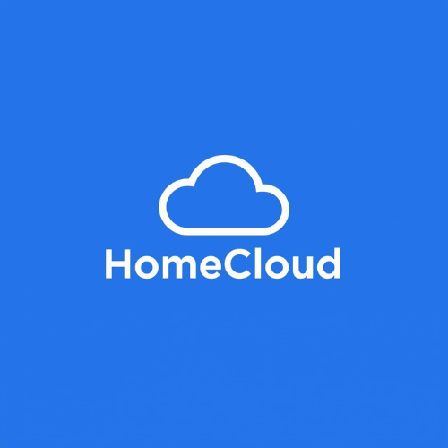

# HomeCloud



**Self-hosted home cloud solution for cost-effective media management and backups.**

---

## Project Goals

Build a complete home media server and backup solution with minimal monthly costs:

- **Photos & Videos**: Cloud backup with disaster recovery (~$3.65/month for 100GB)
- **Movies, TV, Books, Music**: Local storage on 26TB SSD (no cloud costs)
- **Total Cost**: ~$3-5/month (just photo backup) vs $10-20/month for commercial services

### Architecture

- **Photos**: Local Immich server + AWS S3 backup (critical data, worth protecting)
- **Everything Else**: 26TB SSD only (movies, TV, books, music - replaceable if lost)
- **Auto-Start**: All services start automatically on Windows boot

---

## Project Structure

```
HomeCloud/
├── photos/                   # Photos & Videos (AWS S3 backup)
│   ├── terraform/            # AWS S3 infrastructure
│   ├── docker/               # Immich server
│   └── README.md             # Setup guide
│
├── movies/                   # Movies & TV Shows (26TB SSD)
│   ├── docker/               # Emby, Jellyseerr, Sonarr, Radarr
│   └── README.md             # Setup guide
│
├── books/                    # Books & Audiobooks (26TB SSD)
│   ├── docker/               # LazyLibrarian, Calibre
│   └── README.md             # Setup guide
│
├── music/                    # Music (26TB SSD)
│   ├── docker/               # Navidrome
│   └── README.md             # Setup guide
│
├── scripts/                  # Windows startup scripts
│   └── start-all.bat         # Start all Docker containers on boot
│
└── README.md
```

---

## Services

| Category | Service | Purpose | Storage |
|----------|---------|---------|---------|
| **Photos** | Immich | Photo/video backup with AI search | AWS S3 (cloud backup) |
| **Movies** | Emby | Media server for streaming | 26TB SSD |
| **Movies** | Jellyseerr | Request management | 26TB SSD |
| **Movies** | Sonarr | TV show automation | 26TB SSD |
| **Movies** | Radarr | Movie automation | 26TB SSD |
| **Books** | LazyLibrarian | Book management | 26TB SSD |
| **Books** | Calibre | eBook server | 26TB SSD |
| **Music** | Navidrome | Music streaming | 26TB SSD |

---

## Architecture

```
Windows Computer (26TB SSD)
────────────────────────────
┌───────────────────────────────────────────┐
│  Docker Containers (Auto-start on boot)   │
│                                           │
│  ┌─────────┐  ┌─────────┐  ┌─────────┐    │
│  │ Immich  │  │  Emby   │  │Navidrome│    │
│  │ Photos  │  │ Movies  │  │  Music  │    │
│  └────┬────┘  └────┬────┘  └────┬────┘    │
│       │            │            │         │
│       │            └─────┬──────┘         │
│       │                  │                │
│       │           26TB SSD Storage        │
│       │           (local only)            │
│       │                                   │
│       │ Monthly S3 Sync (photos only)     │
│       └──────────────────┐                │
└───────────────────────────────────────────┘
                           │
                           ▼
                    ┌─────────────┐
                    │   AWS S3    │
                    │ Photo Backup│
                    │             │
                    │ Primary     │
                    │ us-west-1   │
                    │      │      │
                    │      │ CRR  │
                    │      ▼      │
                    │  Backup     │
                    │ us-west-2   │
                    │ (Glacier)   │
                    └─────────────┘
```

**Key Points:**
- Only photos/videos backed up to AWS S3 (critical personal data)
- Movies, TV, books, music stored on 26TB SSD only (replaceable content)
- All services auto-start on Windows boot
- Monthly cost: ~$3.65 for photo backup only

---

See individual service directories for setup instructions.
